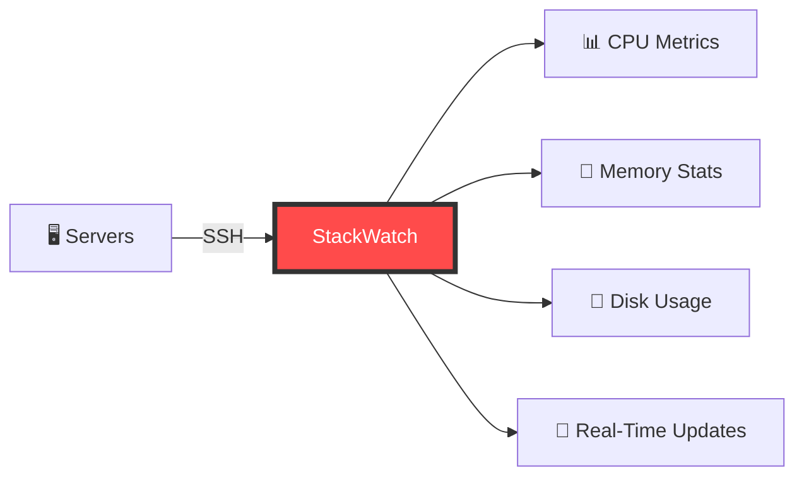
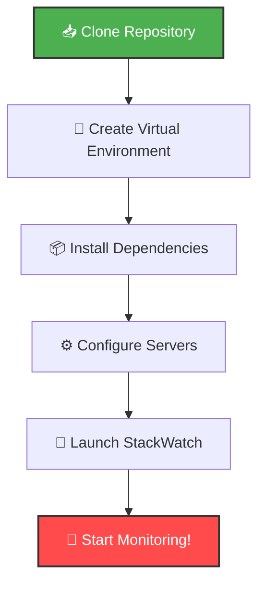
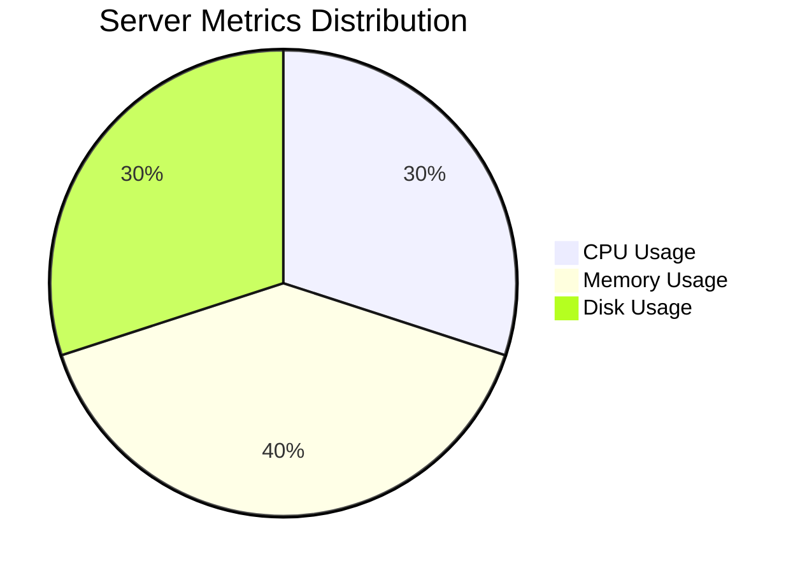
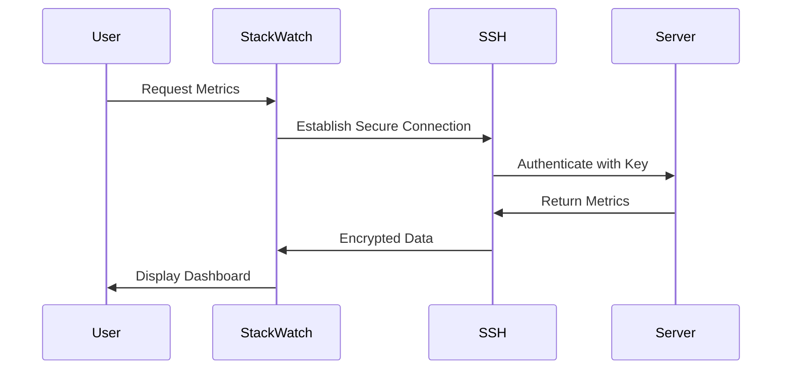
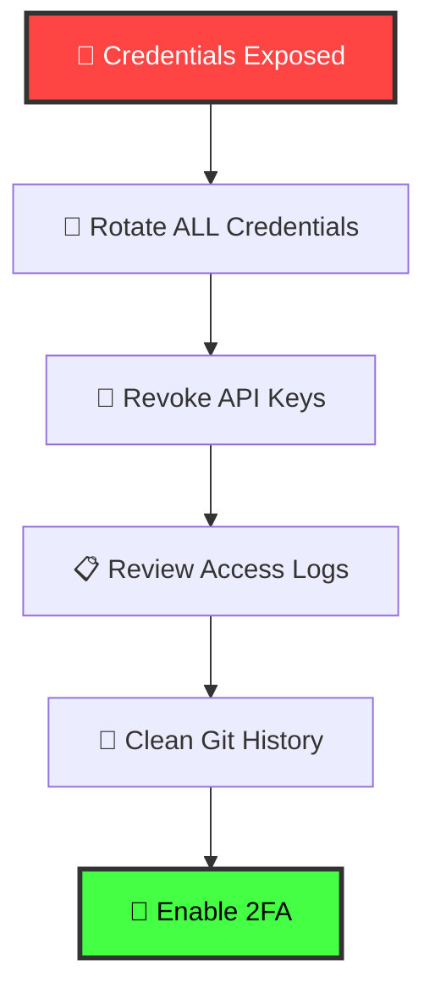
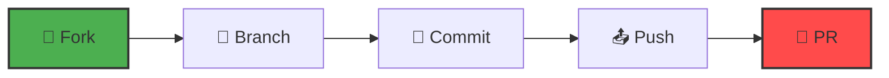

<div align="center">

# 🖥️ StackWatch

### Real-Time Server Monitoring Dashboard

[](https://www.python.org/)
[](https://streamlit.io/)
[](LICENSE)
[](https://github.com/Shahzanabbas-29/StackWatch)

*Monitor your infrastructure with style and precision*


[Features](#-features) • [Installation](#-installation) • [Usage](#️-usage) • [Security](#️-security) • [Documentation](#-documentation)

---

</div>

## 📖 Overview

**StackWatch** is a powerful, lightweight server monitoring solution built with Streamlit. Connect to remote servers via SSH and monitor critical metrics in real-time through an elegant, interactive dashboard.

Perfect for DevOps teams, system administrators, and anyone managing multiple server infrastructures.

<!-- Add a demo GIF here when available -->
<!--  -->


<br>

## ✨ Features

<div align="center">



</div>

<table>
<tr>
<td width="50%">

### 🔄 Real-Time Updates
Automatic refresh every 30 seconds ensures you're always viewing the latest metrics without manual intervention.

</td>
<td width="50%">

### 📊 Comprehensive Metrics
Monitor CPU load, memory utilization, and filesystem usage across all your servers.

</td>
</tr>
<tr>
<td width="50%">

### 🎨 Beautiful UI
Custom-designed interface with color-coded health indicators for instant status recognition.

</td>
<td width="50%">

### 🌐 Multi-Platform
Full support for Linux, HP-UX, AIX, and SunOS operating systems.

</td>
</tr>
<tr>
<td width="50%">

### ⚡ Lightning Fast
Built with performance in mind - minimal overhead, maximum insights.

</td>
<td width="50%">

### 🔐 Secure Connections
SSH-based authentication ensures secure server communication.

</td>
</tr>
</table>

<br>

## 🛠️ Tech Stack

<div align="center">

| Component | Technology | Version |
|-----------|-----------|---------|
| **Frontend Framework** |  | Latest |
| **Backend Language** |  | 3.8+ |
| **SSH Library** |  | Latest |
| **Data Processing** |  | Latest |
| **Auto-refresh** |  | Latest |


</div>

<br>

## 🚀 Installation

<div align="center">



</div>

### Prerequisites

- Python 3.8 or higher
- SSH access to target servers
- Basic understanding of server monitoring

### Quick Start

1️⃣ **Clone the Repository**

```bash
git clone https://github.com/Shahzanabbas-29/StackWatch.git
cd StackWatch
```

2️⃣ **Create Virtual Environment** (Recommended)

```bash
# Linux/MacOS
python -m venv venv
source venv/bin/activate

# Windows
python -m venv venv
venv\Scripts\activate
```

3️⃣ **Install Dependencies**

```bash
pip install -r requirements.txt
```

4️⃣ **Configure Your Servers**

Add your server credentials to `.streamlit/secrets.toml` (see [Security](#️-security) section):

```toml
[servers]
hosts = ["192.168.1.10", "192.168.1.11"]
users = ["monitor", "admin"]
# Use SSH keys instead of passwords in production!
```

5️⃣ **Launch StackWatch**

```bash
streamlit run app.py
```

6️⃣ **Open Your Browser**

Navigate to `http://localhost:8501` and start monitoring!

<div align="center">


</div>

<br>

## 🗂️ Project Structure

```
StackWatch/
│
├── 📄 app.py                    # Main Streamlit application
├── 📋 requirements.txt          # Python dependencies
├── 🖼️ SAIL_Logo.png            # Dashboard logo
│
├── 📁 .streamlit/
│   └── secrets.toml             # Secure credentials (DO NOT COMMIT)
│
├── 📁 utils/                    # (Optional) Helper modules
│   ├── ssh_manager.py           # SSH connection handling
│   └── metrics_parser.py        # Metric extraction utilities
│
└── 📄 README.md                 # You are here!
```

<br>

## ⚙️ Usage

### Dashboard Overview

Once launched, StackWatch displays:

<div align="center">



</div>

<table>
<tr>
<td width="25%" align="center">
<h4>🎯 Server Status</h4>
Real-time UP/DOWN indicators
</td>
<td width="25%" align="center">
<h4>⚙️ CPU Metrics</h4>
Current load percentages
</td>
<td width="25%" align="center">
<h4>💾 Memory Stats</h4>
Used vs. available memory
</td>
<td width="25%" align="center">
<h4>📂 Disk Usage</h4>
Filesystem utilization alerts
</td>
</tr>
</table>

### Example Output

```
┌─────────────────────────────────────────────────────────────┐
│ 🖥️  Server: 10.145.25.5                   Status: 🟢 UP    │
├─────────────────────────────────────────────────────────────┤
│ ⚙️  CPU Usage: 35.4%                                        │
│ 💾 Memory Usage: 2048MB / 4096MB (50%)                     │
│                                                             │
│ 📂 Filesystem Utilization:                                 │
│ ┌───────────┬──────┬──────┬───────┬──────┬─────────────┐ │
│ │ Filesystem│ Size │ Used │ Avail │ Use% │ Mounted on  │ │
│ ├───────────┼──────┼──────┼───────┼──────┼─────────────┤ │
│ │ /dev/sda1 │  20G │  15G │   5G  │  75% │ /           │ │
│ │ tmpfs     │  1G  │ 0.1G │  0.9G │  10% │ /tmp        │ │
│ └───────────┴──────┴──────┴───────┴──────┴─────────────┘ │
└─────────────────────────────────────────────────────────────┘
```

### Health Indicators

<div align="center">

| Indicator | Status | CPU Range | Action Required |
|-----------|--------|-----------|-----------------|
| 🟢 Green | Healthy | 0-60% | None |
| 🟡 Yellow | Warning | 61-85% | Monitor closely |
| 🔴 Red | Critical | 86-100% | Immediate attention |
| ⚫ Gray | Offline | N/A | Check connectivity |


</div>

<br>

## 🛡️ Security

> **⚠️ CRITICAL: This section must be read before deployment**

<div align="center">



</div>

### 🚨 Security Checklist

- [ ] **NEVER commit credentials** to version control
- [ ] Use `.streamlit/secrets.toml` or environment variables
- [ ] Implement SSH key authentication (not passwords)
- [ ] Use strict host key verification in production
- [ ] Rotate all credentials immediately if exposed
- [ ] Enable firewall rules for SSH access
- [ ] Implement rate limiting for dashboard access
- [ ] Use HTTPS in production environments

### Secure Credential Management

**❌ DON'T DO THIS:**
```python
# NEVER hardcode credentials
username = "admin"
password = "password123"  # TERRIBLE IDEA
```

**✅ DO THIS INSTEAD:**

Create `.streamlit/secrets.toml`:
```toml
[ssh]
host = "192.168.1.10"
username = "monitor"
key_path = "/home/user/.ssh/id_rsa"
```

Access in code:
```python
import streamlit as st

host = st.secrets["ssh"]["host"]
username = st.secrets["ssh"]["username"]
key_path = st.secrets["ssh"]["key_path"]
```

### SSH Key Authentication

Replace password authentication with SSH keys:

```bash
# Generate SSH key pair
ssh-keygen -t ed25519 -C "stackwatch@monitoring"

# Copy public key to server
ssh-copy-id -i ~/.ssh/id_ed25519.pub user@server
```

### If Credentials Were Exposed

<div align="center">



</div>

1. **Rotate ALL credentials immediately**
2. **Revoke compromised API keys**
3. **Review access logs for suspicious activity**
4. **Clean git history** (use `git-filter-repo`)
5. **Enable 2FA where available**

<br>

## 🎯 Roadmap

### 🔜 Coming Soon

- [ ] 🔑 SSH key authentication (priority)
- [ ] 📧 Email/SMS alerts for critical thresholds
- [ ] 📊 Historical data graphing and trends
- [ ] 🐳 Docker containerization
- [ ] 🔐 Built-in authentication system
- [ ] 🌙 Dark mode toggle

### 💡 Future Ideas

- [ ] Multi-tenant support
- [ ] Custom alert rules engine
- [ ] Integration with Prometheus/Grafana
- [ ] Mobile-responsive design
- [ ] Database connection monitoring
- [ ] Kubernetes cluster monitoring
- [ ] Export reports to PDF/CSV

<br>

## 🤝 Contributing

<div align="center">


</div>

Contributions are welcome! Here's how you can help:



1. 🍴 Fork the repository
2. 🔧 Create a feature branch (`git checkout -b feature/AmazingFeature`)
3. 💾 Commit your changes (`git commit -m 'Add some AmazingFeature'`)
4. 📤 Push to the branch (`git push origin feature/AmazingFeature`)
5. 🎉 Open a Pull Request

Please read our [Contributing Guidelines](CONTRIBUTING.md) for details.

<br>

## 📚 Documentation

For detailed documentation, visit our [Wiki](https://github.com/Shahzanabbas-29/StackWatch/wiki) or check out:

- [Configuration Guide](docs/configuration.md)
- [Troubleshooting](docs/troubleshooting.md)
- [API Reference](docs/api.md)
- [Best Practices](docs/best-practices.md)

<br>

## 🐛 Known Issues

- Auto-refresh may cause session state issues with large server counts
- Some AIX systems require custom command formatting
- Windows SSH client compatibility limitations

See [Issues](https://github.com/Shahzanabbas-29/StackWatch/issues) for full list.

<br>

## 📊 Stats

<div align="center">


</div>

<br>

## 📄 License

This project is licensed under the **MIT License** - see the [LICENSE](LICENSE) file for details.

<div align="center">

```
MIT License - Copyright (c) 2024 Shahzan Abbas
Free to use, modify, and distribute with attribution.
```


</div>

<br>

## 👨‍💻 Author

<div align="center">

### Shahzan Abbas

[](https://github.com/Shahzanabbas-29)
[](mailto:shahzanabbas@example.com)
[](https://linkedin.com/in/shahzanabbas)


</div>

<br>

## 🙏 Acknowledgments

- Built with [Streamlit](https://streamlit.io/)
- SSH connectivity via [Paramiko](https://www.paramiko.org/)
- Icons from [Lucide](https://lucide.dev/)
- Inspired by modern DevOps practices

<br>

## ⭐ Show Your Support

If you found this project helpful, please give it a ⭐ on GitHub!

<div align="center">

[](https://star-history.com/#Shahzanabbas-29/StackWatch&Date)

[](https://github.com/Shahzanabbas-29/StackWatch/stargazers)
[](https://github.com/Shahzanabbas-29/StackWatch/network/members)
[](https://github.com/Shahzanabbas-29/StackWatch/watchers)

---

<sub>Built with ❤️ by developers, for developers</sub>


**[⬆ Back to Top](#-stackwatch)**

</div>

---

### ⚠️ Disclaimer

This tool is intended for **internal monitoring purposes only**. Do not use or share production credentials publicly or in any version-controlled repository. Always follow your organization's security policies and best practices.

<div align="center">


</div>

